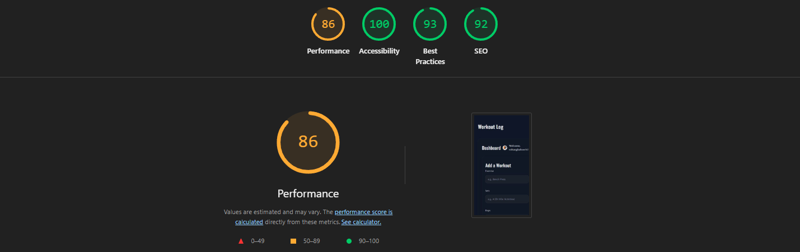

Assignment 3 - Persistence: Two-tier Web Application with Database, Express server, and CSS template
===

### Web Application Title: Workout Log

Rohan Gladson Render Website: https://a3-rohangladson.onrender.com/

### Introduction:

The web application that I create for my assignment was a continuation where I had last left off in Assignment 2, specifically a Workout Log application. The usage of the application is pretty straightforward, in that for any user that intends to use the application, they are expected to first login through GitHub, and afterwards, they would then be lead to the Workout Log application. The goal of the application is also pretty simple in that for any user that would like to track their workouts, they can simply use the application to input their workouts, whether it pertains to weight lifting, body-weight exercise, or even physical activities such as playing basketball or going on a run. 

### Challenges Faces:

While from a user perspective, the application can seem pretty simple in concept, as all your doing is logging in and inputting workout logs, I had faced many challenges when it came to creating this application. This simply comes from how I had compared creating the simple baseline Workout Log application for Assignment 2, to then transitioning towards what needed to be done for Assignment 3. While the visual concepts for both assignments were nearly the same, that is probably only area where the two share similarities. 

While there were many challenges that I had faced, to give a couple of examples one of those came from using Mongo DB for the first time, as I have never used this service. Figuring out how to use the service, along with having to learn the hard way of needing to use the Mongo DB URI, so as to have our Web Application operate took too much time to both understand and implement. 

Another area in which I was initially challenged was how having to implement a different CSS template to our web application. The reason why I was challenged in this area not because using a CSS template, it was more about how for a good part of the assignment, I was having custom CSS formatting and editing, overlapping the CSS template, which in turn was affecting my Performance score on Goggle Lighthouse. While I had my preferences towards my heavy custom CSS templating, I also understood this was affecting two areas of requirement of the assignment that being: we needed the CSS template to do the bulk of our CSS styling, also we need to achieve at least a 90 on Performance on Google Lighthouse. So having to retrace my steps after making heavy process, presented a time issue, as well trying to figure what to take out, and what to keep in. 

### Choice of Authentication Strategy:

When it came to down to choosing which authentication strategy to choose, I had simply gone with the one the required "less" effort to do, that being the GitHub authentication over having to have my user create a username and password to access a dummy account. To be more specific, the reason why I chose the GitHub authentication over the other is because then GitHub would be the one to more so handle the user login in process, whether to is to use an existing GitHub account, or to create a new one. Then, once the user has their GitHub account, they simply now have access towards my Web application. Also it can handle properly handle remembering user's login credentials. If I were to instead go with other option of having me create the implementation to where I would have to create a storage for the user's dummy username and password would both present both a time constraint issue, as well potentially have more program/logistic errors.

### Choice of CSS Template:

The CSS template that I chose for this assignment was Pico.css. The main reason why I had chose this template was mostly because this template followed along with the way that my previous Workout Log for Assignment 2 was structured. Specifically with Pico it allowed for a more classless CSS framework that already provided us clean defaults for things such as buttons and tables, without have me do heavy configuration. The benefit of this mostly came with the Pico do more of the heavy lifting of the CSS, which would leave with having to build the functionality of the Workout Log app while still having parts of own touch. Another that I did not think of initially when I had used, but would later figure out, was that Pico also integrates well with semantic HTML, which helped heavily when tackling our accessibility goals.

To be specific in regards to implementation, I had complemented Pico with my own custom main.css stylesheet to adapt the default look to my something similar to my previous assignment's theme. In this file, I had defined a dark color scheme, and in turn customized Pico's CSS variables (such as background, accent, muted text, border radius), and introduced utility classes such as .sr-only for accessibility and .muted for subtle text. Oher minor components that I had implemented in main.css was adjusting form layout using CSS Grid, as well as creating certain special styles for elements like the login card or even "danger" buttons. 

### List of Express Middleware Packages:

So the list of Express Middleware Packages that I used goes as follows:

**Express Middleware Used** 
- helmet: Adds security headers and a Content Security Policy to protect the app from common web vulnerabilities.

- morgan: Provides HTTP request logging in the console for easier debugging during development.

- express.urlencoded(): Parses URL-encoded form data so that data submitted through forms can be accessed in req.body.

- express.json(): Parses incoming JSON requests so the API endpoints can handle JSON payloads.

- express.static(): Serves static files (e.g., CSS, client-side JS, images) from the public folder.

- express-session: Manages user sessions on the server with cookies, enabling login persistence.

- connect-mongo: Persists session data into MongoDB, so users stay logged in even if the server restarts.

- passport.initialize(): Initializes Passport for handling authentication requests.

- passport.session(): Integrates Passport with sessions so authenticated users remain logged in across requests.

**Custom Middleware/Functions**

- wantsJSON(req): Utility function that checks whether a request expects a JSON response (based on headers) and ensures the API responds correctly for AJAX vs. normal requests.

- ensureAuth(req, res, next) – Custom authentication guard that ensures only logged-in users can access protected API routes (e.g., workout CRUD operations); otherwise returns a 401 error. 

### Technical Achievement(s):

### Part 1: GitHub Authentication 

So, as I mentioned earlier, I had chosen OAuth authentication approach for this assignment. The way that I had gone about this way by first using passport.js with the "passport-github2" strategy, after which I would then integrate into my Express server. What would follow after that would be me then starting configuring session management with "express-session" and "connect-mongo", with the purpose ultimately being to ensure that login data persisted in MongoDB. The importance of this was more so that users remain authenticated across requests. After which I would then initialize Passport with both "passport.initialize()" and "passport.session()", in which I would then define "serializeUser" and "deserializeUser" use purpose was to store a slimmed-down user object in the session.

Now when transitioning towards actually implementing the GitHub strategy itself, I would first have to go towards GitHub's Developer settings, and create secret environment variable whether that pertained towards Client ID, Client secrets, and even the Callback URL. From that, each that I ran the Web Application in Render, I would create new environment variable, in which I input these secure variables. In it verify callback, the way that I went about it was be upserting user records in the users collection, in which by doing so, it would get to keep GitHub profiles in sync and in return a simplified object to the session. 

Other components that were needed form this implementation was that routes were added at "/auth/github" to begin authentication, "/auth/github/callback" to handle GitHub's redirect, and "/logout" to close the session. Now when transition to the Front End, main.js would then "calls /api/me", which would then check login state, and afterwards it would switch between the login screen and workout dashboard depending on authentication. The last point in regards to this is that protected routes like "/api/workouts" used a custom ensureAuth middleware to block unauthenticated requests, with the significance of this being that it would allow for more secure access to user data.

**Challenge(s) that were Faced:**

- Updates would have to be constantly made as I would transition from either using localhost or Render, which meant that it was presented it's own problems as GitHub requires exact redirect URIs, so switching between http://localhost:3000/auth/github/callback for local development and the deployed Render/Vercel callback often caused errors until both were registered in the OAuth app.

- Another challenge that I faced with the authentication process was trying to ensure the proper database initialization before authentication. What I mean by this, is that given that the GitHub strategy's verify callback upserts users into MongoDB, my application would have to guarantee the database connection and collections were ready before handling login requests. The problems that came with this is that throughout the modification process of the OAuth, I had a fair share of instances where authentication would fail, which resulted in server errors or the page not even loading. 

### Part 2: Using a Different Web Service Host - Vercel

So, I had used Vercel as my secondary hosting site for my web application. Similar to most of the other members of the class, I had a fair share of issues using Vercel over Render. Primarily, there needed to be further implementations and code changes in my repository to accommodate the usage of Vercel. Additionally, one of the other components to keep in mind when deploying to a new hosting site was to adjust the OAuth authorization callback URL so that authentication could be used with my Web app. Although I encountered my fair share of issues, I was still able to adjust certain components to properly deploy my Web app, similar to Render. Ultimately, while Vercel has its pros, including faster deployment, it shares many similarities with Render, but is somewhat more confusing to use. 

**Challenge(s) that were Faced: (Reiterating Previous Remarks)**
- One of the challenges that I had faced with using Vercel was less of Vercel, but more transitioning towards using Vercel, in that I had OAuth Callback URL mismatch issues. What I mean by this is that I had to update the GitHub callback URL to match Vercel's assigned domain. Even a missing hyphen caused DEPLOYMENT_NOT_FOUND errors.

- Another issue that I came across was was when I had used Vercel, I am came across issues in server configuration. What I mean by this, is that unlike Render, when I had Vercel, what took me little longer to understand is that it optimized for front-end and serverless apps, so that would that I would have to rework components of my server.js, by adding a custom Vercel handler, so as to be include a vercel.json file. The problem with that though, is that unless you don't know that already, then you are going to have spend more time then necessary trying to figure that out, and by that point you might as well use Render.

### Part 3: Improving Google Lighthouse Scores

**What I had Started out**

**VS** 

**What I finished with**

**IMPORTANT NOTE: For my scores, while I was able to achieve a 100% score for three out of the four categories, I was not able to get a 100% on my Performance (98%). However, after talking with a TA from the course, I was informed that as long as I was only a couple of points off, I should be good**

When started of testing with Google Lighthouse, I had first gotten the following scores:
- Performance: 86%
- Accessibility: 100%
- Best Practices: 93%
- SEO: 92%

After collecting that information, other then Accessibility, the other categories needed to be worked on, as those score were much less than 100%. 

**Improving Performance Score:**

Now unlike the other two catgories (Best Practices and SEO), improving upon Performance was going to be the biggest challenge, and the way that had I had first started off by increasing my Performance score was by taking down much of the custom CSS that I had for my Web Application, which I had mentioned earlier when discussing my CSS template choice. Given that I had implemented things such as using a Google Font, and even using "Font Awesome's" CDN font was lead to much linking which resulted in an influx of Render blocking requests. By removing my reliance on custom CSS options, then leaning more towards my CSS template (Pico.css), and ultimately embedding lightweight SVG icons locally, it in turn eliminated unnecessary font-loading delays. 

This change alone boosted my Performance score from an 86%, all the way up to a 95%. Afterwards, small changes that I had made towards improving the score even more was by deferring non-critical JavaScript, so as to cut down on blocking resources and improve first contentful paint (FCP). With all these changes, I was ultimately able to get my Performance all the way up to a 98%

**Challenge(s) that were Faced:**
- While trying to rework parts of my program was challenging, if I had to pick the main challenge that I had, it was trying to boost my score from a 98% to a 100%, as the changes that would have to made, would be both minimal, yet impactful. This led me down a rabit hole where I would constantly make small changes here and there to see if I that would boost my Performance score, but it would either result in the following: 
Either my web application would crash/the page could not be found, or my Performance would go down from a 98% to lower a percentage. It was only after a conversation with TA, that I was informed that it was understandable that I was not able to get that 2%, and informed that it would be best to move on. 

**Improving "Best Practices" Score:**
Now unlike, improving my Performance score, I had faced less issue when trying to improve my Best Practices Score, as the areas the needing fixing were a lot more straightforward. What I mean by this is that the area of fixing for "Best Practices" focused on resolving the browser console and DevTools issues flagged under Content Security Policy (CSP) violations. Prior towards making any changes, the reason why this was originally highlighted was because my application relied on the default Helmet configuration (app.use(helmet())). While Helmet did provide a good baseline, the issue that comes with it, is that it is too restrictive, which prevented external GitHub avatar images from loading, which in turn cause repeated console errors and warnings.

The way in which I went about improving my score here was by first replacing the default Helmet call with a custom configuration. What I mean by this, is that I modified by instead defining explicit CSP directives, which had in turn balanced security with functionality. For example, I initially had restricted scripts to only load from 'self', allowed styles and fonts from jsDelivr (my CDN), and added GitHub’s avatar domain (https://avatars.githubusercontent.com) to img-src. To also help with this I had also disabled crossOriginEmbedderPolicy to prevent breaking CDN fonts and images. 

**Challenge(s) that were Faced:**

- The main challenge that I faced when it came to modifying the information was similar to that of Performance, in that I was trying to basically make small, yet impactful changes to boost my percentage. Some of this would come by trying to find the right balance between strictness and usability, as if I were to use too tight of a CSP, it would break necessary app features, while overly loose settings weakened security. 

**Improving "SEO" Score:** 
Similar to trying to improve my Best Practices score, I did not face to many issues when it came to improving my SEO score, as the need for changes was pretty straightforward and minimal. What I had to tackle specfically in this regard, was addressing issues that were flagged under Crawling and Indexing. To be even more specific, Lighthouse had reported that my robots.txt file was invalid, with 146 errors, which meant that search engine crawlers could not properly interpret my rules for indexing the site, which at worst could lead to a huge number users not being able to find my site. 

Now, while this would not heavily the case of the assignment, given that it was limiting my SEO score, I had go about it. The way in which I would resolve the case was by first creating a minimal robots.txt file, whose purpose was to explicitly allow crawlers to access my application. By serving it correctly from the root (/robots.txt) and ensuring it contained valid directives, I was able to eliminate the parsing errors that Lighthouse had detected. Again, while this is not necessarily a major in regards to the my applications overall effectiveness, the significance of it more so comes from providing crawlers with a clear path to index my application’s pages.

**Challenge(s) that were Faced:**
- While I did not face any major computational challenges with fixing my SEO score, and if anything, I more so struggled with a minor challenge, which was trying to identify why the robots.txt was failing. At first, I initially thought an additional sitemap.xml file might be required, but after analyzing Lighthouse feedback, it was just that I had not properly formatted robots.txt. So if anything it was more so just a reading and understanding issue if anything at all. 

---

### Design Achievement(s): 

**Workout Log Login Page**

**Workout Log Dashboard**

### Part 1: Implementing Accessibility Tips

Now when aiming to implement more accessibility towards my page, the way that I went about it was by simply choosing four options from each of three categories (Writing, Design, Development). By doing so, my hope was to have more of a balanced Web Application, that accommodated well towards user accessibility. To start...
**Implemented Writing Tips**

1. **Provide informative, unique page titles:** If you were to look at my Web Page, the way I simply went about doing this was just to have an effective Web Application, title of "Workout Log" so that the purpose of the page becomes immediately clear, while not feeling overly generic. Ultimately, while their could have been more unique titles, with more creativity, my uniqueness comes in that my tile helps users and screen readers automatically understand the applications purpose.

2. **Use headings to convey meaning and structure:** The way I went about using this was pretty straightforward, as we all know that headings have to be effective and clear. So if you were to look at my Web Page, you can see that I "Workout Log" heading on the sign-in page and the "Dashboard" heading once logged in both to clearly signal where the user is and what functionality the section contains.

3. **Make link text meaningful:** This writing tip was also pretty straightforward, but also significant, as simply having towards different services would not be enough, So instead of just having vague text like "click here", I have it where I descriptive actions such as "Sign in with GitHub"; "Add Workout"; "Edit"; and "Delete". With each link or button being labeled it automatically makes its purpose explicit to users so they already have an idea of what it does before interacting with it.

4. **Provide clear instructions:** Now, while instructions are not inherently necessary, as I believe my Web App is pretty straightforward, I still implemented them, given that there might be certain user's who don't fully know the full functionality of the Web Page. So to go about this I implemented instructions here and there throughout my Web Application by having it to where inside input bars, the noticeable placeholders such as "e.g., "Bench Press", which would indicate to user about what kind of data to enter, which in turn reduces the chance of confusion.

**Implemented Design Tips**

5. **Provide sufficient contrast between foreground and background:** This tip was pretty straightforward, as if anything, it was carrying over the approach that I had with assignment 2. Specifically, the way in which accompted to this accessibility was simply by having white text against a dark navy background, creating strong contrast that improves readability for users with low vision or color sensitivity. Along with that, I also had it to where the buttons (Blue for "Add Workout" and Red for "Delete") also contrast well with the surrounding dark interface, ensuring visibility.

6. **Ensure that interactive elements are easy to identify:**
Similar to the previous tip, I had carried over the design process that I had used in the previous assignment, in that I had many of buttons, whether it was: "Sign in with GitHub", "Add Workout', "Edit", "Delete", and "Logout" be stylized and sized to where you can easily differentiate them static text, making it clear on what elements are clickable/interactive.

7. **Provide clear and consistent navigation options:** This was an important to keep in mind, primarily because it centers around the overall assignment, as a major component towards our Web Application is make it so that navigation flow is simple and consistent. So if a user were to use the Workout Log app, they would first start at the sign-in screen, in which they would have to be authenticated via GitHub, and then they are directed to the dashboard. Now after they are done using the app, they can click on the logout button is placed consistently at the top-right corner, so it's clear to find.

8. **Use headings and spacing to group related content:** The last design tip that was aiming for, as I wanted to be sure that not everything was cluttered around the page was have my apps content be clear with meaningful headings (Dashboard, Add a Workout, and All Workouts) and separation between sections. Ultimately by having a less cluttered screen, we can have it to where its easier for users to understand and interact with related elements.

**Implemented Developing Tips**

9. **Use mark-up to convey meaning and structure:** The way in which I went about implementing this tip into my web application was by having to where in my index.html, I have semantic tags such as **header**, **main**, and **section** which give my page a more of unique layout instead of relying only on generic **div** containers. The benefit of this more so comes from how it makes my application easier for screen readers and assistive technologies to interpret, since the hierarchy of content is clearly conveyed. Another simple, yet major component to this is the usage of headings such as **h1** and **h2**, as they were primarily used label major sections of Web page such as "Dashboard" or "Add a Workout", allowing the page to be easier to user by users with accessibility tools.

10. **Include alternative text for images:** The way in which I went about implementing this tip was by having it where all all images in the application, such as the Workout Log logo, include unique **alt** attributes. The specific benefits of this implementation is that it provides descriptive text that explains what the image represents when it cannot be seen. So for any of the users that maybe visually impaired and use a screen reader, the screen will then read out what image is. Essentially, the major significance of this is that rather than leaving these attributes empty, the **alt** text was chosen to convey to all users, regardless of vision, that they can understand the content and context of the site.

11. **Ensure that all interactive elements are keyboard accessible:** When it came down to implementing this design tip, was by having it where all of my interactive controls, such as "Add Workout", "Edit", "Delete", and the GitHub login, are implemented with semantic **button** elements instead of clickable **divs**. The significance of why I implemented this into my Web App was that it allowed these buttons to be automatically targetable and activated through keyboard navigation (e.g., tab, enter, and space keys). One of the benefits actually that come from the CSS template the at I used for my Web App, Pico.css, is that it also applies visible focus states, making it clear which element is currently selected when navigating without a mouse. 

12. **Help users avoid and correct mistakes:** The last design tip that I implemented to my Web App was having it where my workout form would have built-in safeguards, so as avoid users from inputting the wrong thing. For example, if a user was using the Workout log to fill out strength the strength components of their workout then they would have to fill out the information that numeric input such as reps and weight. However if the user were to input bodyweight exercises and activities then the numeric values would be defaulted to  "0", since those specific exercise don't involve values. This prevents invalid submissions and helps guide users toward correct data entry from the start.  

### Part 2: Usage of CRAP Principles

- **C - Contrast:** When discussing the way in which I worked in the CRAP princple - Contrast, was by having it to where at the beginning page that the user will see, they will come across many contrasting elements on the page, which would ultimately help them identify what are more important interactive elemetnts. For example if we were to start at the starting page, you can see that the entire background of the app is coverd in a dark-navy blue, which creates a more neutral setting, until you then come across a couple of key standout, two of these being the  white heading, "Workout Log" and the Central GitHub login button. The significance of the login button is given the most emphasis on the page as both it's placement and styling allow it to where users cannot possible miss the first step in using the application. Next, after the user logs in, they are then brought towards the application dashboard, in which if you were to look at either the labels or headings, they are displayed in bold white text, while the "Add Workout" button is highlighted with a bright blue fill that contrasts heavily with both the background and surrounding fields. You can also see this when it comes to the "Delete" button, as I have it styled in red, reinforcing its warning type action to users before they proceed.

- **R - Repetition:** The way in which I would go about using repetition throughout my Workout Log application, is by starting with having it where across both the sign-in page and dashboard, I have it to where the typography is kept consistent. What I mean by this is that I have my bold text, which are primarily used of headings of page(s), but then I implement more of a lighter shades of gray are used for secondary text such as form labels or instructions. If you also look throughout my webpage, you can see that more of a card-style layout repetition, in that if you were to look at my application, you can see that between the sign-in box, the "Add Workout" form, and the "All Workouts" log, there exits a familiar structure no matter which task the user is completing. This can also be found when you see how I have the buttons on my page set up, as they also have repeated styles, in that they have rounded edges and clearly legible text, with the only contrasting point being that their colors change depending on their type of function.

- **A - Alignment:** The next concept from the CRAP principle being Alignment, plays an important role in web application, given that it's main purpose is to help make web applications easier to read. To start off, if you were to look at sign in page, you can see that overall format of page relies on center alignment. This can be see all the way at the top left with the "Workout Log" heading, down to the center of login card, as all components of the page are directing the user's focus towards the main part that requires their attention. Now, once we transition over towards the Dashboard page, we can the alignment of the page shifts to becoming more of a a structured grid system, as all the form fields for "Exercise", "Sets", "Reps", and "Weight" are horizontally aligned. The significance of this is that it ensures that  the input lines are lined up neatly, so as to make easier for the user to read. Now transitioning towards the main area in which alignment is used is down below, where you can see the "All Workouts" section, which I have it set up to use a table format with columns precisely aligned for each attribute. The significance of this, is that it organizes the  users data in a way that is easy to compare. 

- **P - Proximity:** Now, when approaching the use of the last CRAP principle - proximity, the way in which I went about using it was to group related elements together and separate unrelated ones. Now, the way in which I went about applying this principle was if you were to look at my dashboard, the "Add a Workout" fields are grouped within a bordered card. What this makes clears is that everything that falls under that grouping (exercise name, sets, reps, weight, type, and notes) are all part of a single task. If you were to look even further, you can see that within that grouping, there are related items that are placed close together, such as the "Strength" and "Activity" radio buttons, which even though they are separated from the notes field, they are still positioned near the other workout details. Now, if we wanted to opposite of this where the we have an element that is separated, as it is unrelated to the others, then look towards the login page, where login card is centered and isolated, making it the only focal point on screen.
